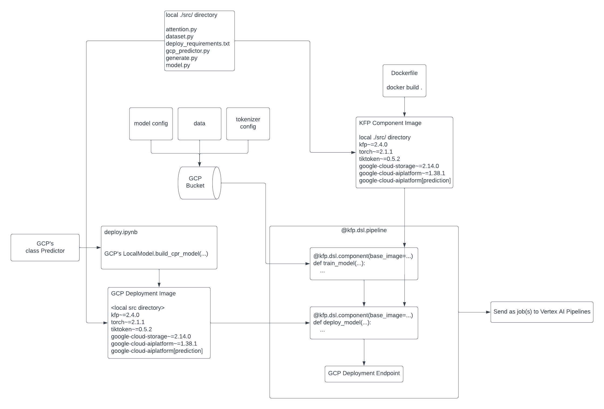

## Homemade custom GPT trained on Tiny Shakespeare dataset

Trained via NVIDIA 2070 Super (Desktop) and NVIDIA 3070 (Laptop)

Follows theoretical concepts in Karpathy's tutorial but diverges in implementation.

Custom MultiheadAttention implementation performs as fast as torch's nn.MultiheadAttention and allows possibility of cross-attention.

Custom SelfMultiheadAttentionBlock similar to torch's nn.TransformerEncoderLayer.

Careful variable naming (closely following torch's naming style) and plenty of in-line documentation allows for easy understanding of repo.

Added training and Deployment on GCP.

Our Parameters:
- vocab_dim=50257
- sequence_dim=100
- embed_dim=78
- num_heads=13
- num_layers=4
- Total: 8193457 parameters (incl embedding layer)

GPT-2 Parameters:
- vocab_dim=50257
- sequence_dim=1024
- embed_dim=768
- num_heads=12
- num_layers=12
- Total: 163059793 parameters (incl embedding layer)

Next steps:
- nn.Parallel for multi GPU scaling
- training on more datasets

Recommended to have pytorch v2 or higher to experiment with `is_causal` parameter in `nn.MultiheadAttention.foward`

## References

nanoGPT - https://github.com/karpathy/nanoGPT

1706 - Attention is All You Need - https://arxiv.org/abs/1706.03762

1806 - GPT-1 - https://openai.com/research/language-unsupervised

1902 - GPT-2 - https://openai.com/research/better-language-models

2005 - GPT-3 - https://arxiv.org/pdf/2005.14165.pdf

## Repository Structure

- data/
    - `shakespeare.txt` - 40000 lines of shakespeare
- src/
    - `__init__.py` - mediates a package reference error upon containerized deployment vs local runtime
    - `attention_slow.py` - original attention module in Karpathy's tutorial
    - `attention.py` - an optimized attention module for faster training; interface mirrors PyTorch's nn.MultiheadAttention
    - `dataset.py` - wraps the dataset into a PyTorch's dataset class
    - `deploy_requirements.txt` - deployment image will `pip install` this
    - `gcp_predictor.py` - required in deployment image; follows GCP deployment interface
    - `generate.py` - helper function for generating text using trained model
    - `model.py` - GPT model; imports `attention.py`
- `deployment.ipynb` - deploy a trained gpt model to vertex ai model registry
- `Dockerfile` - for kubeflow image
- `gpt.ipynb` - training gpt locally
- `kfp tutorial.ipynb` - simple example on how to use kubeflow
- `pipeline.ipynb` - training and deploying gpt on vertex ai
- `README.md` - you are reading this right now
- `requirements.txt` - kubeflow image will `pip install` this

